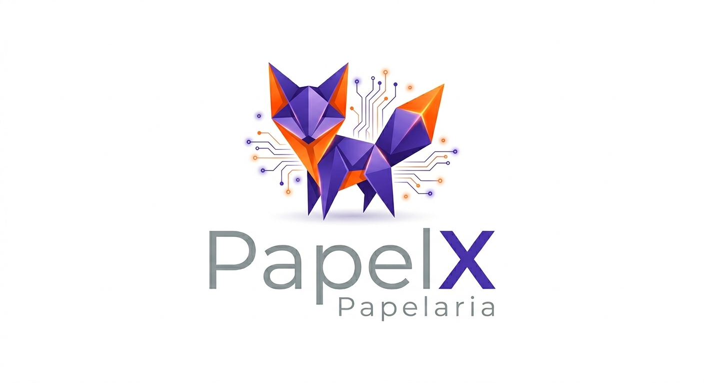

<div align="center">
  
</div>

---

## 🗺️ Roadmap Project
- [x] Initial folder structure and repository configuration
- [ ] Implement database in-memory
- [ ] CRUD for Products (`feat/create`, `feat/list`, etc.)
- [ ] Merge to develop
- [ ] Merge to staging
- [ ] Merge to main
- [ ] Go live in production

---

# ✏️ PapelX - Gestão de Papelaria (Backend)

O **PapelX** é um sistema de gerenciamento para papelarias que expõe uma API robusta para o controle de produtos (canetas, cadernos, papéis), gerenciamento de estoque e fluxo de vendas. O projeto foi desenvolvido como um CRUD limpo, focado em performance, simplicidade de execução e estruturado com as novidades do C# e .NET 10.

## 🛠️ Tecnologias e Ferramentas Utilizadas

* **Linguagem:** C# (.NET 10)
* **Framework:** ASP.NET Core Web API
* **IDE:** JetBrains Rider Community
* **Arquitetura:** Clean Architecture (Foi projetada e preparada para scalar horizontalmente.)
* **Banco de Dados:** In-Memory

## 📐 Estrutura do Projeto

O ecossistema do código está dividido para garantir a separação de responsabilidades:
* **PapelX.WebApi:** Camada única que expõe os endpoints da APIs.

## 🚀 Como Executar o Projeto

### Pré-requisitos
* .NET 10 SDK instalado localmente.
* Editor de texto ou IDE de sua preferência

### Passo a Passo

1. **Clonar o repositório:**
   ```bash
   git clone https://github.com/HelderS1501/PapelX.git
   cd PapelX
   ```

2. **Rodar a Aplicação:**
   ```bash
   dotnet run --project src/PapelX.WebApi/PapelX.WebApi.csproj
    ````

3. **Abrir no Navegador:**
    ```bash
        A API iniciará localmente. Você pode acessar a documentação interativa dos endpoints pelo Scalar através do navegador em: http://localhost:5000/scalar
    ```
### 📌 Principais Endpoints do CRUD

#### 📦 Produtos (Materiais, Cadernos, Escritório)

    GET /api/produtos - Lista todos os produtos da papelaria com paginação e filtros.
    GET /api/produtos/{id}` - Obtém os detalhes de um item específico pelo ID.
    POST /api/produtos` - Cadastra um novo produto (valida campos obrigatórios, preço e estoque inicial).
    PUT /api/produtos/{id}` - Atualiza as informações de um item existente.
    DELETE /api/produtos/{id}` - Remove o produto do catálogo da papelaria.
