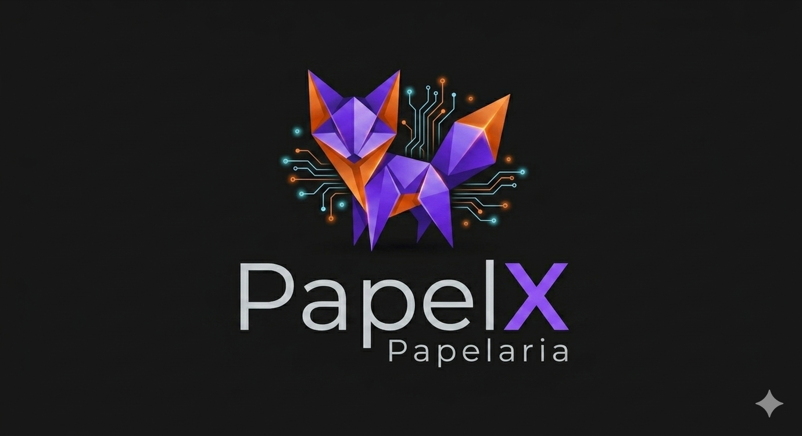

<div align="center">
  
</div>

---

# ✏️ PapelX - Gestão de Papelaria (Backend)

O **PapelX** é um sistema de gerenciamento para papelarias que expõe uma API robusta para o controle de produtos (canetas, cadernos, papéis), gerenciamento de estoque e fluxo de vendas. O projeto foi desenvolvido como um CRUD limpo, focado em performance, simplicidade de execução e estruturado com as novidades do C# e .NET 10.

## 🛠️ Tecnologias e Ferramentas Utilizadas

* **Linguagem:** C# (.NET 10)
* **Framework:** ASP.NET Core Web API
* **IDE:** JetBrains Rider Community
* **Arquitetura:** Clean Architecture / Camadas (Domain, Infrastructure, Application, API)
* **Banco de Dados:** Entity Framework Core (LocalDB / SQL Server instalado na máquina)

## 📐 Estrutura do Projeto

O ecossistema do código está dividido para garantir a separação de responsabilidades:
* **PapelX.Domain:** Entidades centrais (ex: `Produto`, `Categoria`), Enums e regras puras de validação de negócio.
* **PapelX.Infrastructure:** Contexto do banco de dados (`DbContext`), migrações e persistência dos dados (Repositórios).
* **PapelX.Application:** Serviços de aplicação, mapeamentos e as regras do CRUD (Casos de Uso).
* **PapelX.API:** Camada de entrada que expõe os endpoints Controllers/Minimal APIs e as configurações da aplicação.

## 🚀 Como Executar o Projeto

### Pré-requisitos
* .NET 10 SDK instalado localmente.


### Passo a Passo

1. **Clonar o repositório:**
   ```bash
   git clone https://github.com/HelderS1501/PapelX.git
   cd PapelX
   ```

2. **Rodar a Aplicação:**
   ```bash
   dotnet run --project src/PapelX.WebApi/PapelX.WebApi.csproj
    ````

3. **Abrir no Navegador:**
    ```bash
        A API iniciará localmente. Você pode acessar a documentação interativa dos endpoints pelo Scalar através do navegador em: http://localhost:5000/scalar
    ```
📌 Principais Endpoints do CRUD

📦 Produtos (Materiais, Cadernos, Escritório)
    `GET /api/produtos` - Lista todos os produtos da papelaria com paginação e filtros.<br>
    `GET /api/produtos/{id}` - Obtém os detalhes de um item específico pelo ID.<br>
    `POST /api/produtos` - Cadastra um novo produto (valida campos obrigatórios, preço e estoque inicial).<br>
    `PUT /api/produtos/{id}` - Atualiza as informações de um item existente.<br>
    `DELETE /api/produtos/{id}` - Remove o produto do catálogo da papelaria.<br>